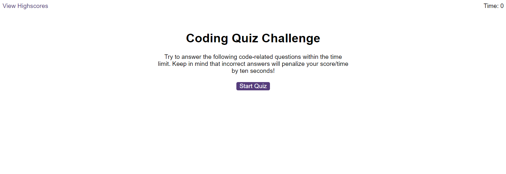

# Code Quiz

## Description
This is a challenge I did for my bootcamp. I was tasked to create a quiz about code. I searched online for several questions as they were not provided by the assignment or in the starter code. Using a mix of what I was taught in classes for the last few weeks, class activities, research and discussing with friends and fellow peers, I was able to meet some of the requirements for this difficult, yet challenging assignment. I also utalised AI when I exhausted every option I could think of to point me in the right direction - though this time I found that in some cases the code would be incorrect even with some needed adjustments.

## Screenshot

## Live
Link: 

## Credits
I used the following to help me get my answer and adjusted some of the code I found as needed:
https://www.w3schools.com/jsref/met_element_setattribute.asp
https://stackoverflow.com/questions/9419263/how-to-play-audio
https://forum.freecodecamp.org/t/how-can-i-store-the-value-of-a-text-input-box-in-a-variable/257867
https://stackoverflow.com/questions/3357553/how-do-i-store-an-array-in-localstorage
https://stackoverflow.com/questions/40250139/how-can-i-push-an-object-into-an-array
https://stackoverflow.com/questions/442384/jumping-to-a-new-html-page-with-javascript
https://www.w3schools.com/jsref/jsref_sort.asp
Xpert learning AI provided by my bootcamp
Microsoft Copilot
ChatGPT

Questions from:
https://www.shecodes.io/athena/52336-how-to-create-a-countdown-timer-in-javascript
https://www.linkedin.com/pulse/javascript-multiple-choice-quiz-javascript-code-k8jsc

## Lisence
MIT Lisence